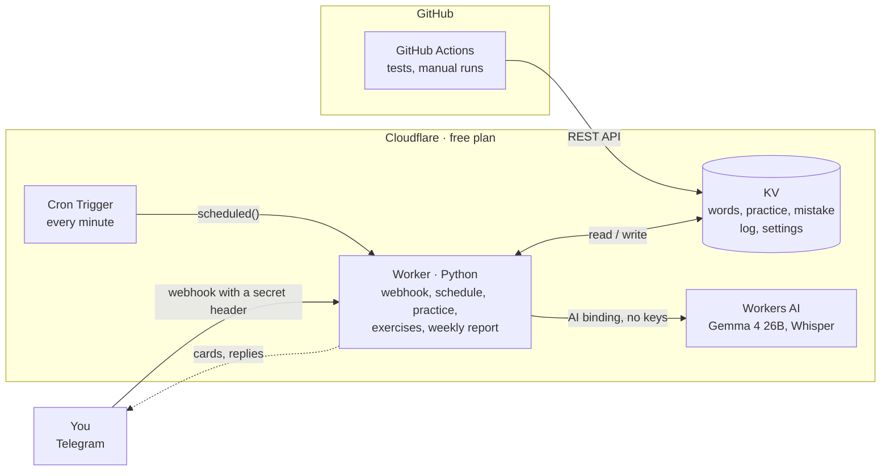

# VocabTGBot

[Русский](README.md) · **English**

A __COMPLETELY FREE__ Telegram bot for English vocabulary: no server, no paid APIs. Cards arrive on their own during the day, the AI picks words and examples for your level, and what you learn is reinforced by practice, exercises and your own sentences — **typed or as voice messages**.


## Architecture



## Stack

| | |
|---|---|
| Language | Python (shared logic in `shared/` for the Worker and Actions) |
| Bot and schedule | Cloudflare Workers (Python / Pyodide) + Cron Triggers |
| Storage | Cloudflare KV |
| AI | Cloudflare Workers AI: Gemma 4 26B (text), Whisper large v3 turbo (voice messages) |
| Tests | unittest, GitHub Actions |
| Messenger | Telegram Bot API |

## Features

- **Scheduled cards**: 14 slots a day, 6 of them for new words; «Знаю» (Know), «Не знаю» (Don't know), «📥 В архив» (Archive, sends the next word right away) buttons. Intervals: a day → three days → practice; «Не знаю» postpones by 30 minutes, 2 hours, tomorrow. After «Знаю» the AI sends a tip on other ways the word is used, with examples in three tenses.
- **🗣 Your own sentences instead of «Знаю»** — typed or as **voice messages**, one at a time and with no limit. The AI reviews each one right away and shows how to say it more naturally; on «🏁 Готово» (Done) it explains other ways the word is used, with examples in the past, present and future. One correct sentence is enough for the word to count.
- **AI cards**: `/gen 5 travel`, or add a word yourself and the AI writes three examples (past, present, future) at your level using the grammar you have gaps in. The same word is never offered twice.
- **Practice at 22:30**: type learned words in both directions; a typo is "almost", a mistake means learning it again.
- **Exercises at 20:00**: A1–B2 grammar from the British Council syllabus (67 rules) plus your own words. The code picks the rules (weak spots, new, review); the AI only writes sentences.
- **Weekly report**: words learned, mistakes, progress by level A1–B2 and advice from the AI.
- **Level A1–B2**, exercise topics and archive review live in «⚙️ Настройки» (Settings); friends can be let in with `/allow`, each with their own words.

## A word's path

Adding → both sides of the card → reviews after a day and after three days → typed practice → archive. A mistake in practice sends the word back to the start; «📥 В архив» skips everything.

## Models

Gemma 4 26B was chosen by comparing the free Workers AI models: the best exercises and translations at ~3 "neurons" per card out of 10,000 free per day. Voice messages (Telegram's OGG/Opus) are transcribed by Whisper large v3 turbo with no re-encoding. `json_schema` is not used — the model made more mistakes with it; dataclasses in `shared/ai.py` define the answer shape.

## Development

```bash
make test      # tests
make deploy    # tests, deploy, health check
make dev       # run locally
make help      # everything else
```

Code: `shared/bot/` — the bot split by feature, `shared/*.py` — logic without I/O (`curriculum`, `compose`, `exercises`, `srs`…), `worker/src/entry.py` — the Worker entry point.
