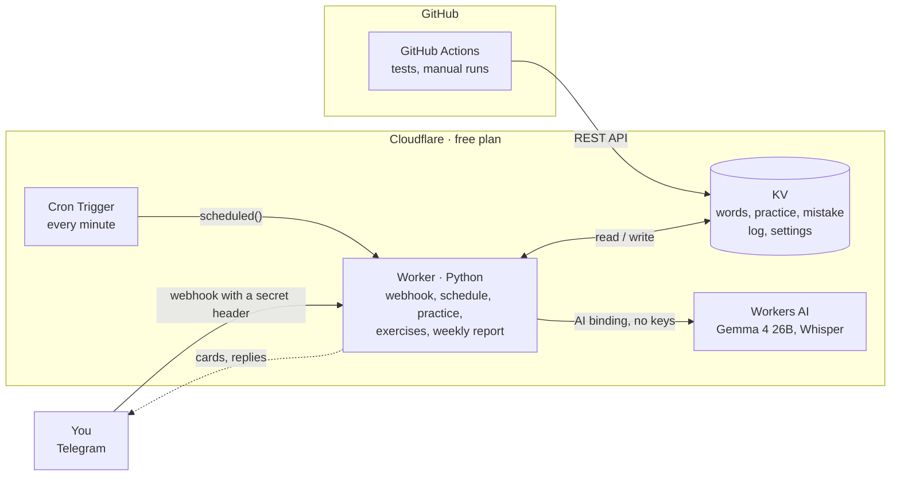

# VocabTGBot

[Русский](README.md) · **English**

__COMPLETELY FREE__: no rented server and no paid APIs. A Telegram bot for learning English words: flashcards with spaced repetition, typed practice, and an AI that picks new words and examples for your level.

I couldn't find a free app that does all of this together. Anki has no AI card generation and no flexible way to decide when words are sent as notifications. Here cards arrive in Telegram on their own throughout the day, and you answer each one with a single tap.

Recognising a word on a card doesn't mean you remember it, so every evening the bot runs a short practice: you type the learned words yourself, in both directions. Mistakes aren't lost — once a week the bot shows which words and directions you get wrong most often.

The bot's interface is in Russian: it is built for Russian speakers learning English.


## Architecture



## Stack

| | |
|---|---|
| Language | Python (shared logic in `shared/` for the Worker and Actions) |
| Bot and schedule | Cloudflare Workers (Python / Pyodide) + Cron Triggers |
| Storage | Cloudflare KV |
| AI | Cloudflare Workers AI: Gemma 4 26B (text), Whisper large v3 turbo (voice messages) |
| Tests | GitHub Actions |
| Messenger | Telegram Bot API |

## Features

- **14 scheduled slots a day** (10:00–23:00 Moscow time by default), 6 of them reserved for new words, so a hard word can't take over the whole day. The translation is hidden under a spoiler; below the card are the buttons «Знаю» (I know), «Не знаю» (I don't know) and «📥 В архив» (To archive) — the last one sends the word straight to the archive, skipping the remaining steps.
- **Your own sentences instead of «Знаю»**: the «🗣 Составить предложения» (Make sentences) button under a card — write 2–3 sentences with the word or record a voice message (up to a minute, transcribed by Whisper). The AI reviews every sentence, shows how to say it more naturally and explains the mistake. The code decides whether the word counts: used correctly in at least two sentences — like «Знаю», otherwise like «Не знаю». This way you don't just recognise the word, you learn to use it when speaking.
- **Both directions in one slot**: answer «Знаю» to the RU→EN card and the EN→RU one arrives right away.
- **Spaced repetition**: «Знаю» schedules the word for the next day, then three days later. «Не знаю» does not put the word next in line but postpones it by 30 minutes, then 2 hours, then to tomorrow; one word is never shown more than three times a day.
- **Practice every evening at 22:30**, in batches of 7: words that made it through the intervals have to be typed out. Transcription in brackets is ignored, and when a word has several translations one is enough — the bot shows the others. A typo counts as "almost"; a mistake sends the word back to be learned again.
- **Missed cards are not lost.** While a card is unanswered no new ones arrive; once you answer, all the missed ones come at once.
- **AI card generation** on a topic in your own words: `/gen 5 travel`. A generated card first comes to you for review — you can edit or delete it. The bot remembers every word it has ever offered, deleted ones included, so the same word never comes twice. If the queue is empty, the AI suggests a new word on its own.
- **Manual adding** in a single message: `apple - яблоко` plus examples and synonyms. Either language can come first; duplicates are rejected. If you give no examples or synonyms, the AI writes them and shows the card for review — accept it, edit it, or keep the word without examples.
- **A global language level** (A1–B2): new words, examples and exercises follow it. Generation can have its own level and follows the global one by default.
- **Two examples for every new word, built on your grammar**: they are written at your level and, where it is natural, use the rules you currently have gaps in — words and grammar are learned together.
- **Exercises every day at 20:00** — 5 fill-the-gap tasks from an A1–B2 grammar syllabus ([British Council – EAQUALS Core Inventory](https://www.eaquals.org/resources/the-core-inventory-for-general-english/), 67 rules) plus words from your own vocabulary. You answer with a button (prepositions, articles, modals) or type the right form (tenses, conditionals, passive). They wait until you finish them and never get in the way of cards. «🧩 Темы упражнений» (Exercise topics) lets you keep only the sections you want. A task that looks ambiguous can be marked «🤔 Спорное» (Disputed) — it won't count.
- **The code picks the rules, not the AI**: roughly half of each batch is weak spots, a third is new rules in syllabus order (mostly your level, every third one a check of the levels below) and the rest is review of mastered rules. The AI only writes sentences for the given rules; the code validates every task and grades the answers itself. A mistake in a task with one of your words moves that word one interval back.
- **Progress by level**: a rule counts as mastered after 4+ attempts with 80% correct among the last five. Stats show how many A1, A2, B1 and B2 rules you have mastered, which level has gaps and which rules come next.
- **Weekly report on Sundays at 21:00**: words learned, what is in the queue, practice mistakes per direction, exercise results, weak spots, progress by level and a short AI review with advice on what to focus on.
- **Archive review**: the bot sends the list of learned words; reply with the numbers of the ones you've forgotten and they go back into learning.
- **Access for friends** via `/allow` — each person has their own words.

## Menu

The main menu holds what you use every day:

```
[ 🃏 Карточка сейчас ] [ 🧠 Практика     ]
[ ✍️ Упражнения      ] [ 🤖 AI-Генерация ]
[ ⚙️ Настройки ]
```

(Card now, Practice, Exercises, AI generation, Settings.) «⚙️ Настройки» keeps the rarely used ones: 🎚 Level, 🧩 Exercise topics, 📊 Stats, 🔁 Review archived words, ❓ Help and ⬅️ Back.

## A word's path

1. **Adding.** You add a word yourself or the AI generates it. An AI card first goes to review: send it to the queue, edit it or delete it.
2. **First meeting.** Both sides arrive in one slot: RU→EN first, then EN→RU. «Не знаю» postpones the word by 30 minutes, then 2 hours, then to tomorrow. Instead of «Знаю» you can make your own sentences with the word — typed or spoken.
3. **Spaced reviews.** A day later, then three days later. Every «Знаю» moves the word forward; «Не знаю» sends it back to the start of the intervals.
4. **Evening practice.** You type the word in both directions:
   - correct — the word goes to the archive;
   - typo — tomorrow brings one more EN→RU card and another practice;
   - mistake — the word is learned again from step 2.
5. **Archive.** With «🔁 Повтор архивных слов» (Review archived words) a forgotten word can be brought back and learned again from step 2.

The «📥 В архив» button under a card skips steps 2–4: the word goes straight to the archive.

## Why Gemma 4

The model was chosen by comparing the free Workers AI models on real tasks: Gemma 4 26B produced 16 correct exercises out of 16 and the best card translations, at ~3 "neurons" per card out of 10,000 free per day. DeepSeek V4, Kimi K2.6 and GLM 5.3 are paid-plan only, while Llama 4 Scout and gpt-oss got the rules themselves wrong. Whisper takes Telegram voice messages (OGG/Opus) as they are, with no re-encoding; the bot passes no `initial_prompt` — in testing it broke recognition. `json_schema` mode is not used: with it Workers AI emits fields in alphabetical order, the model writes the answer before the sentence and makes more mistakes (16 valid out of 20 vs 20 out of 20 without it) — a JSON sample in the prompt defines the shape instead.

## Code

| Module | What it does |
|---|---|
| `shared/bot/` | the bot split by feature: cards, vocabulary, generation, practice, exercises; command and button routes in `core.py` |
| `shared/compose.py` | your own sentences with a word: AI review, the pass rule, voice transcription |
| `shared/curriculum.py` | the A1–B2 syllabus, rule mastery, planning an exercise batch |
| `shared/ai.py` | model answers as dataclasses: JSON sample for the prompt and parsing the answer into objects |
| `shared/exercises.py`, `generator.py`, `practice.py`, `srs.py`, `words.py` | feature logic without I/O |
| `shared/keys.py`, `storage.py`, `text.py` | KV keys, KV access, shared text checks |
| `worker/src/entry.py` | Cloudflare Worker entry point |

## Development commands

```bash
make test      # all tests
make deploy    # tests, Worker deploy, health check
make dev       # run the Worker locally
make help      # everything else
```
