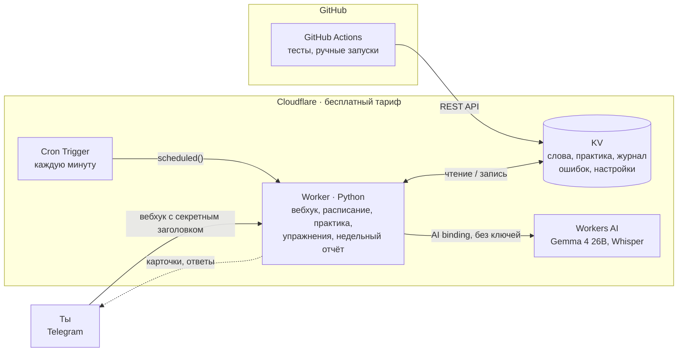

# VocabTGBot

**Русский** · [English](README.en.md)

__ПОЛНОСТЬЮ БЕСПЛАТНЫЙ__ Telegram-бот для английских слов: без сервера и платных API. Карточки сами приходят в течение дня, ИИ подбирает слова и примеры под твой уровень, а выученное закрепляется практикой, упражнениями и своими предложениями — **текстом или голосовыми сообщениями**.


## Архитектура



## Стек

| | |
|---|---|
| Язык | Python (общая логика в `shared/` для Worker и Actions) |
| Бот и расписание | Cloudflare Workers (Python / Pyodide) + Cron Triggers |
| Хранилище | Cloudflare KV |
| ИИ | Cloudflare Workers AI: Gemma 4 26B (тексты), Whisper large v3 turbo (голосовые) |
| Тесты | unittest, GitHub Actions |
| Мессенджер | Telegram Bot API |

## Возможности

- **Карточки по расписанию**: 14 слотов в день, из них 6 под новые слова; кнопки «Знаю», «Не знаю», «📥 В архив» (сразу присылает следующее слово). Интервалы: сутки → три дня → практика; «Не знаю» откладывает на 30 минут, 2 часа, завтра.
- **🗣 Свои предложения вместо «Знаю»** — текстом или **голосовыми**, по одному и без лимита. ИИ сразу разбирает каждое и показывает, как сказать естественнее, а по «🏁 Готово» — советует, как ещё употребляют слово, с примерами в прошедшем, настоящем и будущем. Хватает одного верного предложения — слово засчитано.
- **ИИ-карточки**: `/gen 5 путешествия` или добавь слово сам — ИИ допишет три примера (прошедшее, настоящее, будущее время) на твоём уровне и на грамматике, где у тебя пробелы. Одно слово дважды не предлагается.
- **Практика в 22:30**: выученные слова нужно написать в обе стороны; опечатка — «почти», ошибка — учить заново.
- **Упражнения в 20:00**: грамматика A1–B2 по программе British Council (67 правил) и слова из словаря. Правила подбирает код: слабые места, новые, повтор; ИИ только пишет предложения.
- **Недельный отчёт**: выученные слова, ошибки, прогресс по уровням A1–B2 и совет от ИИ.
- **Уровень A1–B2**, темы упражнений и повтор архива — в «⚙️ Настройки»; друзей можно пустить через `/allow`, у каждого свои слова.

## Путь слова

Добавление → обе стороны карточки → повторы через сутки и через три дня → письменная практика → архив. Ошибка на практике возвращает слово в начало, «📥 В архив» пропускает всё сразу.

## Модели

Gemma 4 26B выбрана сравнением бесплатных моделей Workers AI: лучшие упражнения и переводы при ~3 «нейронах» на карточку из 10 000 бесплатных в день. Голосовые (OGG/Opus из Telegram) расшифровывает Whisper large v3 turbo без перекодирования. `json_schema` не используется — с ним модель ошибалась чаще; форму ответа задают dataclass'ы в `shared/ai.py`.

## Разработка

```bash
make test      # тесты
make deploy    # тесты, деплой, проверка
make dev       # локальный запуск
make help      # остальное
```

Код: `shared/bot/` — бот по фичам, `shared/*.py` — логика без ввода-вывода (`curriculum`, `compose`, `exercises`, `srs`…), `worker/src/entry.py` — точка входа Worker.
