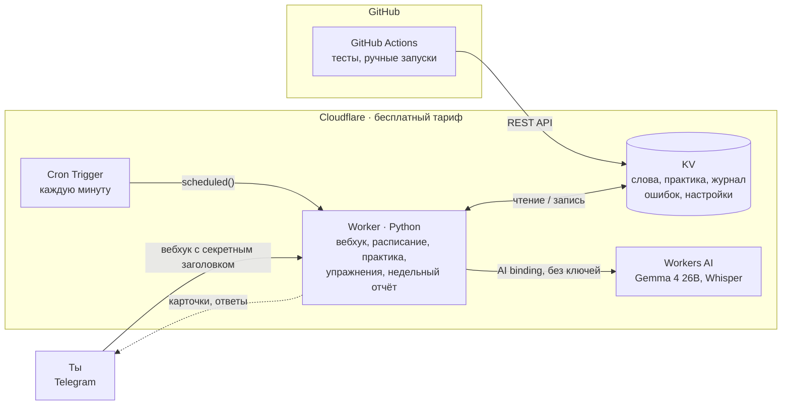

# VocabTGBot

**Русский** · [English](README.en.md)

__ПОЛНОСТЬЮ БЕСПЛАТНЫЙ__: без аренды сервера и без платных API. Telegram-бот для изучения английских слов: карточки с интервальными повторами, письменная практика и ИИ, который подбирает новые слова и примеры под твой уровень.

Я не нашёл бесплатного приложения, которое делало бы всё это вместе. У Anki нет генерации карточек через ИИ и нельзя гибко настроить, когда присылать слова через уведомления. Здесь карточки сами приходят в Telegram в течение дня, а отвечать на них можно одним нажатием.

Узнать слово на карточке — ещё не значит его помнить, поэтому каждый вечер бот устраивает короткую практику: выученные слова нужно написать самому в обе стороны. Ошибки не теряются — раз в неделю бот показывает, в каких словах и направлениях ты ошибаешься чаще всего.


## Архитектура



## Стек

| | |
|---|---|
| Язык | Python (общая логика в `shared/` для Worker и Actions) |
| Бот и расписание | Cloudflare Workers (Python / Pyodide) + Cron Triggers |
| Хранилище | Cloudflare KV |
| ИИ | Cloudflare Workers AI: Gemma 4 26B (тексты), Whisper large v3 turbo (голосовые) |
| Тесты | GitHub Actions |
| Мессенджер | Telegram Bot API |

## Возможности

- **14 слотов в день по расписанию** (по умолчанию 10:00–23:00 МСК), из них 6 зарезервированы под новые слова — трудное слово не может занять весь день. Перевод скрыт под спойлером, под карточкой кнопки «Знаю», «Не знаю» и «📥 В архив» — последняя сразу отправляет слово в архив, минуя остальные шаги.
- **Свои предложения вместо «Знаю»**: кнопка «🗣 Составить предложения» под карточкой — пишешь 2–3 предложения со словом или записываешь голосовое (до минуты, его расшифрует Whisper). ИИ разбирает каждое предложение, показывает, как сказать естественнее, и объясняет ошибку. Засчитано ли слово, решает код: если оно правильно употреблено хотя бы в двух предложениях — как «Знаю», иначе — как «Не знаю». Так слово не только узнаёшь, но и учишься им пользоваться в речи.
- **Обе стороны за один слот**: ответил «Знаю» на RU→EN — карточка EN→RU приходит сразу.
- **Интервальные повторы**: «Знаю» отправляет слово на повтор через сутки, затем через три дня. «Не знаю» не ставит слово следующим, а откладывает на 30 минут, потом на 2 часа, потом на завтра; больше трёх показов одного слова в день не бывает.
- **Практика каждый вечер в 22:30** порциями по 7 слов: слова, прошедшие повторы, нужно написать самому. Транскрипция в скобках не учитывается, из нескольких вариантов перевода достаточно одного — бот подскажет остальные. Опечатку засчитывает как «почти», за ошибку отправляет слово учить заново.
- **Пропущенные карточки не теряются.** Пока нет ответа, новые не приходят, а после ответа приходят все накопившиеся.
- **Генерация карточек ИИ** по теме своими словами: `/gen 5 путешествия`. Сгенерированная карточка сначала приходит на проверку, её можно исправить или удалить. Бот помнит все слова, которые когда-либо предлагал, включая удалённые, поэтому одно и то же слово дважды не придёт. Если очередь пуста, ИИ сам предложит новое слово.
- **Добавление вручную** одним сообщением: `apple - яблоко` плюс примеры и синонимы. Порядок языков любой, дубли бот отсекает. Если примеры и синонимы не указаны, их придумает ИИ и покажет карточку на проверку — можно принять, исправить или оставить слово без примеров.
- **Общий уровень языка** (A1–B2): по нему подбираются новые слова, примеры и упражнения. Для генерации можно выбрать свой уровень, по умолчанию она следует общему.
- **Два примера к каждому новому слову на твоей грамматике**: примеры пишутся на твоём уровне и, где это естественно, на тех правилах, в которых у тебя сейчас пробелы, — слова и грамматика учатся вместе.
- **Упражнения каждый день в 20:00** — 5 заданий с пропуском по программе грамматики A1–B2 ([British Council – EAQUALS Core Inventory](https://www.eaquals.org/resources/the-core-inventory-for-general-english/), 67 правил) и на слова из твоего словаря. Ответ кнопкой (предлоги, артикли, модальные) или вводом формы слова (времена, условные, пассив). Упражнения ждут, пока не пройдёшь, и не мешают карточкам. В «🧩 Темы упражнений» можно оставить только нужные разделы. Спорное задание можно отметить «🤔 Спорное» — оно не засчитается.
- **Правила подбирает код, а не ИИ**: в каждой пачке примерно половина — слабые места, треть — новые правила по порядку программы (в основном твоего уровня, каждое третье — проверка уровней ниже) и остальное — повтор освоенного. ИИ только пишет предложения под заданные правила, а код проверяет каждое задание и сам сверяет ответы. Ошибка в задании со словом из словаря откатывает это слово на один интервал назад.
- **Прогресс по уровням**: правило считается освоенным после 4+ попыток и 80% верных среди последних пяти. В статистике видно, сколько правил A1, A2, B1 и B2 освоено, на каком уровне есть пробелы и какие правила дальше.
- **Недельный отчёт по воскресеньям в 21:00**: сколько слов выучено, что в очереди, ошибки на практике по направлениям, итоги упражнений, слабые места, прогресс по уровням и короткий разбор от ИИ с советом, на что обратить внимание.
- **Повтор архива**: бот присылает список выученных слов, в ответ пишешь номера забытых, и они возвращаются в обучение.
- **Доступ для друзей** через `/allow` — у каждого свои слова.

## Меню

Главное — то, чем пользуешься каждый день:

```
[ 🃏 Карточка сейчас ] [ 🧠 Практика     ]
[ ✍️ Упражнения      ] [ 🤖 AI-Генерация ]
[ ⚙️ Настройки ]
```

В «⚙️ Настройки» спрятано редкое: 🎚 Уровень, 🧩 Темы упражнений, 📊 Статистика, 🔁 Повтор архивных слов, ❓ Помощь и ⬅️ Назад.

## Путь слова

1. **Добавление.** Слово добавляешь сам или его генерирует ИИ. Карточка от ИИ сначала попадает на проверку: её можно отправить в очередь, исправить или удалить.
2. **Знакомство.** В одном слоте приходят обе стороны: сначала RU→EN, сразу за ней EN→RU. «Не знаю» откладывает слово на 30 минут, потом на 2 часа, потом на завтра. Вместо «Знаю» можно составить со словом свои предложения — текстом или голосом.
3. **Повторы по интервалам.** Через сутки, затем через три дня. Каждое «Знаю» двигает слово дальше, «Не знаю» возвращает его в начало интервалов.
4. **Практика вечером.** Слово нужно написать в обе стороны:
   - верно — слово уходит в архив;
   - опечатка — завтра придёт ещё одна карточка EN→RU и снова практика;
   - ошибка — слово учится заново с шага 2.
5. **Архив.** Через «🔁 Повтор архивных слов» забытое слово можно вернуть и выучить заново с шага 2.

Кнопка «📥 В архив» под карточкой пропускает шаги 2–4: слово уходит в архив сразу.

## Почему Gemma 4

Модель выбрана сравнением бесплатных моделей Workers AI на реальных заданиях: Gemma 4 26B дала 16 верных упражнений из 16 и лучшие переводы карточек, при этом стоит ~3 «нейрона» за карточку из 10 000 бесплатных в день. DeepSeek V4, Kimi K2.6 и GLM 5.3 доступны только на платном плане, а Llama 4 Scout и gpt-oss ошибались в сути правил. Голосовые Telegram (OGG/Opus) Whisper принимает как есть, без перекодирования; подсказку `initial_prompt` бот не передаёт — на проверке она ломала распознавание. Режим `json_schema` не используется: с ним Workers AI выдаёт поля по алфавиту, модель пишет ответ раньше предложения и чаще ошибается (16 годных из 20 против 20 из 20 без схемы) — форму ответа задаёт образец JSON в промпте.

## Код

| Модуль | Что делает |
|---|---|
| `shared/bot/` | бот по фичам: карточки, словарь, генерация, практика, упражнения; маршруты команд и кнопок в `core.py` |
| `shared/compose.py` | свои предложения со словом: разбор ИИ, зачёт, расшифровка голосовых |
| `shared/curriculum.py` | программа A1–B2, освоение правил, план пачки упражнений |
| `shared/ai.py` | ответы модели как dataclass'ы: образец JSON для промпта и разбор ответа в объекты |
| `shared/exercises.py`, `generator.py`, `practice.py`, `srs.py`, `words.py` | логика фич без ввода-вывода |
| `shared/keys.py`, `storage.py`, `text.py` | ключи KV, доступ к KV, общие проверки текста |
| `worker/src/entry.py` | точка входа Cloudflare Worker |

## Команды разработки

```bash
make test      # все тесты
make deploy    # тесты, деплой воркера, проверка ответа
make dev       # локальный запуск воркера
make help      # остальные команды
```
