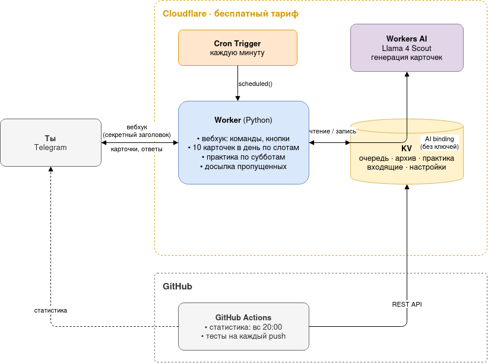

# VocabTGBot

__ПОЛНОСТЬЮ БЕСПЛАТНЫЙ__: без аренды сервера и без платных API. Telegram-бот для заучивания английских слов по карточкам с ИИ генерацией текста или ручным добавлением

Я не нашёл бесплатного приложения, которое делало бы всё это вместе. У Anki нет генерации карточек через ИИ и нельзя гибко настроить, когда присылать слова уведомлениями. Здесь карточки приходят сами уведомлением в Telegram несколько раз в день, а отвечать на них — одним нажатием.

## Архитектура

## Стек

| | |
|---|---|
| Язык | Python (общая логика в `shared/` для Worker и Actions) |
| Бот и расписание | Cloudflare Workers (Python / Pyodide) + Cron Triggers |
| Хранилище | Cloudflare KV |
| ИИ | Cloudflare Workers AI, Llama 4 Scout |
| Статистика и тесты | GitHub Actions |
| Мессенджер | Telegram Bot API |

## Возможности

- **10 карточек в день по расписанию** По дефолту (10:00–23:00 МСК). Перевод скрыт под спойлером, под карточкой кнопки «Знаю» и «Не знаю».
- **Слово проверяется в обе стороны**: сначала RU→EN, потом EN→RU.
- **Субботняя практика**: выученные слова нужно написать самому. Опечатку бот засчитывает как «почти», за ошибку отправляет слово учить заново.
- **Пропущенные карточки не теряются.** Пока нет ответа, новые не приходят, а после ответа приходят все накопившиеся.
- **Генерация карточек ИИ** по уровню (A1–C1) и теме своими словами: `/gen 5 B2 путешествия`. Сгенерированная карточка сначала приходит на проверку, её можно исправить или удалить. Если очередь пуста, ИИ сам предложит новое слово.
- **Добавление вручную** одним сообщением: `apple - яблоко` плюс примеры и синонимы. Порядок языков любой, дубли бот отсекает.
- **Повтор архива**: бот присылает список выученных слов, в ответ пишешь номера забытых, и они возвращаются в обучение.
- **Статистика** за неделю и доступ для друзей через `/allow` (у каждого свои слова).

## Путь слова

1. **Добавление.** Слово добавляешь сам или его генерирует ИИ. Карточка от ИИ сначала попадает на проверку: её можно отправить в очередь, исправить или удалить.
2. **RU→EN.** Видно русское слово, английское скрыто. «Знаю» — слово переходит на следующий шаг, «Не знаю» — возвращается третьим в очередь.
3. **EN→RU.** То же в обратную сторону. После «Знаю» слово ждёт практики.
4. **Практика в субботу.** Слово нужно написать в обе стороны:
   - верно — слово уходит в архив;
   - опечатка — слово встаёт вторым в очередь, будет ещё одна карточка EN→RU и снова практика;
   - ошибка — слово учится заново с шага 2, третьим в очереди.
5. **Архив.** Через «Повторить слова» забытое слово можно вернуть и выучить заново с шага 2.
