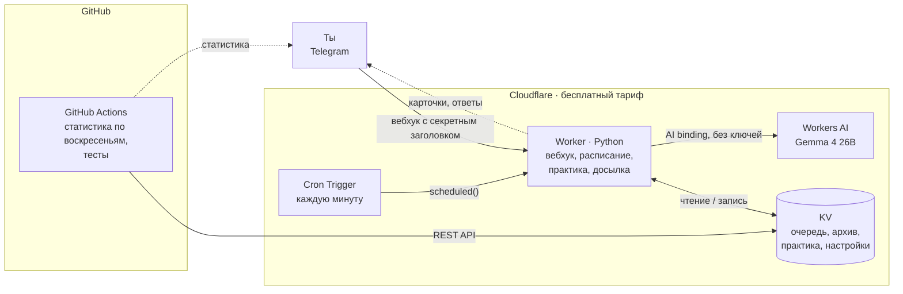

# VocabTGBot

**Русский** · [English](README.en.md)

__ПОЛНОСТЬЮ БЕСПЛАТНЫЙ__: без аренды сервера и без платных API. Telegram-бот для изучения английских слов: карточки с интервальными повторами, письменная практика и ИИ, который подбирает новые слова и примеры под твой уровень.

Я не нашёл бесплатного приложения, которое делало бы всё это вместе. У Anki нет генерации карточек через ИИ и нельзя гибко настроить, когда присылать слова через уведомления. Здесь карточки сами приходят в Telegram в течение дня, а отвечать на них можно одним нажатием.

Узнать слово на карточке — ещё не значит его помнить, поэтому каждый вечер бот устраивает короткую практику: выученные слова нужно написать самому в обе стороны. Ошибки не теряются — раз в неделю бот показывает, в каких словах и направлениях ты ошибаешься чаще всего.


## Архитектура



## Стек

| | |
|---|---|
| Язык | Python (общая логика в `shared/` для Worker и Actions) |
| Бот и расписание | Cloudflare Workers (Python / Pyodide) + Cron Triggers |
| Хранилище | Cloudflare KV |
| ИИ | Cloudflare Workers AI, Gemma 4 26B |
| Статистика и тесты | GitHub Actions |
| Мессенджер | Telegram Bot API |

## Возможности

- **14 слотов в день по расписанию** (по умолчанию 10:00–23:00 МСК), из них 6 зарезервированы под новые слова — трудное слово не может занять весь день. Перевод скрыт под спойлером, под карточкой кнопки «Знаю», «Не знаю» и «📥 В архив» — последняя сразу отправляет слово в архив, минуя остальные шаги.
- **Обе стороны за один слот**: ответил «Знаю» на RU→EN — карточка EN→RU приходит сразу.
- **Интервальные повторы**: «Знаю» отправляет слово на повтор через сутки, затем через три дня. «Не знаю» не ставит слово следующим, а откладывает на 30 минут, потом на 2 часа, потом на завтра; больше трёх показов одного слова в день не бывает.
- **Практика каждый вечер в 22:30** порциями по 7 слов: слова, прошедшие повторы, нужно написать самому. Транскрипция в скобках не учитывается, из нескольких вариантов перевода достаточно одного — бот подскажет остальные. Опечатку засчитывает как «почти», за ошибку отправляет слово учить заново.
- **Пропущенные карточки не теряются.** Пока нет ответа, новые не приходят, а после ответа приходят все накопившиеся.
- **Генерация карточек ИИ** по теме своими словами: `/gen 5 путешествия`. Сгенерированная карточка сначала приходит на проверку, её можно исправить или удалить. Бот помнит все слова, которые когда-либо предлагал, включая удалённые, поэтому одно и то же слово дважды не придёт. Если очередь пуста, ИИ сам предложит новое слово.
- **Добавление вручную** одним сообщением: `apple - яблоко` плюс примеры и синонимы. Порядок языков любой, дубли бот отсекает. Если примеры и синонимы не указаны, их придумает ИИ и покажет карточку на проверку — можно принять, исправить или оставить слово без примеров.
- **Общий уровень языка** (A1–C1): по нему ИИ подбирает новые слова и примеры. Для генерации можно выбрать свой уровень, по умолчанию она следует общему.
- **Недельная статистика**: сколько слов выучено, что в очереди и где ошибки на практике — счётчики по направлениям и слова, в которых ошибаешься чаще всего.
- **Повтор архива**: бот присылает список выученных слов, в ответ пишешь номера забытых, и они возвращаются в обучение.
- **Доступ для друзей** через `/allow` — у каждого свои слова.

## Меню

Главное — то, чем пользуешься каждый день:

```
[ 🃏 Карточка сейчас ] [ 🧠 Практика   ]
[ 🤖 AI-Генерация    ] [ ⚙️ Настройки  ]
```

В «⚙️ Настройки» спрятано редкое: 🎚 Уровень, 📊 Статистика, 🔁 Повтор архивных слов, ❓ Помощь и ⬅️ Назад.

## Путь слова

1. **Добавление.** Слово добавляешь сам или его генерирует ИИ. Карточка от ИИ сначала попадает на проверку: её можно отправить в очередь, исправить или удалить.
2. **Знакомство.** В одном слоте приходят обе стороны: сначала RU→EN, сразу за ней EN→RU. «Не знаю» откладывает слово на 30 минут, потом на 2 часа, потом на завтра.
3. **Повторы по интервалам.** Через сутки, затем через три дня. Каждое «Знаю» двигает слово дальше, «Не знаю» возвращает его в начало интервалов.
4. **Практика вечером.** Слово нужно написать в обе стороны:
   - верно — слово уходит в архив;
   - опечатка — завтра придёт ещё одна карточка EN→RU и снова практика;
   - ошибка — слово учится заново с шага 2.
5. **Архив.** Через «🔁 Повтор архивных слов» забытое слово можно вернуть и выучить заново с шага 2.

Кнопка «📥 В архив» под карточкой пропускает шаги 2–4: слово уходит в архив сразу.

## В планах

- **Упражнения по темам** раз в день, в 20:00 МСК: вставить предлог, поставить глагол в нужное время, вставить слово из своего словаря, артикли, формы слова. Темы ИИ подбирает по уровню, а можно выбрать свои. Упражнения не мешают карточкам.
- **ИИ-анализ слабых мест**: бот запоминает, в каких правилах ты ошибаешься, и чаще даёт задания именно на них — то же правило, но в других предложениях и конструкциях. Раз в неделю — короткий разбор с советами.

## Команды разработки

```bash
make test      # все тесты
make deploy    # тесты, деплой воркера, проверка ответа
make dev       # локальный запуск воркера
make help      # остальные команды
```
